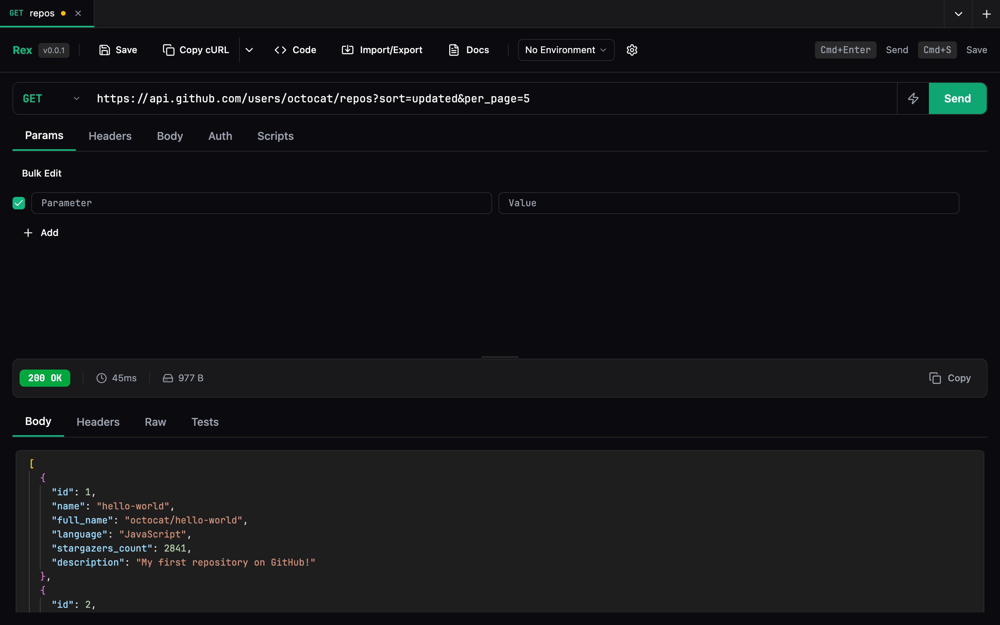
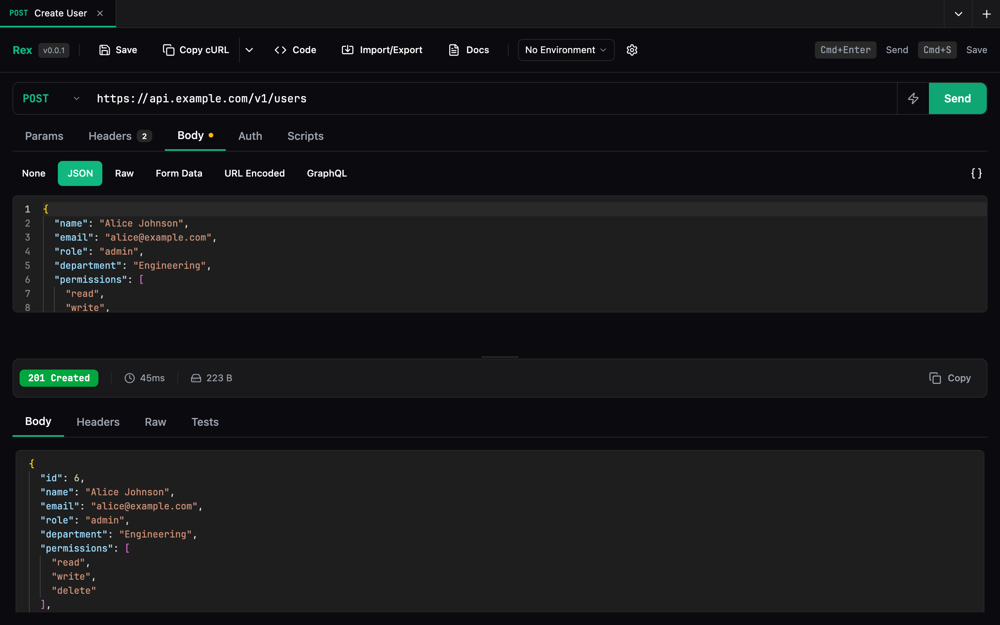
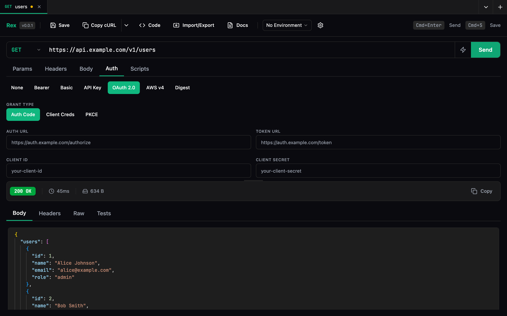
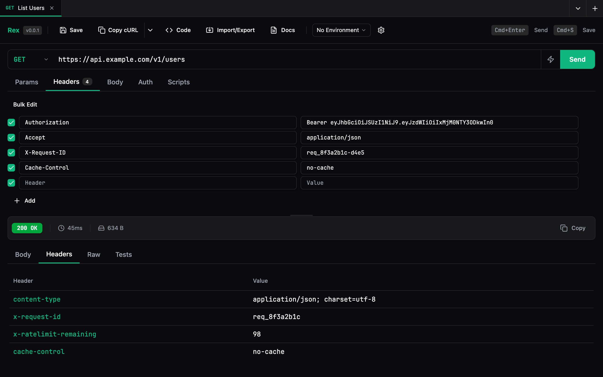

<p align="center">
  <a href="https://devembers.com">
    
  </a>
</p>
<p align="center">
  <strong>Built by <a href="https://devembers.com">DevEmbers</a></strong>
</p>

---

# Rex — API Client

A fast, keyboard-driven REST API client for VS Code. Test HTTP requests, GraphQL, WebSockets, and SSE without leaving your editor.



## Features

- **HTTP requests** — GET, POST, PUT, PATCH, DELETE, HEAD, OPTIONS with query params, headers, and body editors
- **Multiple body types** — JSON (with syntax highlighting), raw text, form data with file uploads, URL-encoded, GraphQL, or none
- **Authentication** — Bearer, Basic, API Key, OAuth 2.0 (Authorization Code, Client Credentials, PKCE), AWS Signature V4, Digest
- **Response viewer** — syntax-highlighted JSON, HTML preview, image rendering, PDF viewer, hex dump for binary
- **Real-time streaming** — Server-Sent Events and WebSocket connections with live message logs
- **Collections** — save, organize, and drag-and-drop requests into collections
- **Environments** — create variable sets and reference them with `{{variable}}` syntax anywhere in requests
- **History** — every request logged with full response, searchable, with side-by-side diff viewer
- **Request chaining** — build sequences of dependent requests with variable passing and test assertions
- **Pre-request & test scripts** — JavaScript scripting API for dynamic headers, variables, and response testing
- **GraphQL** — dedicated editor with schema introspection and autocomplete
- **Code generation** — generate snippets in JavaScript, Python, cURL, and more
- **API docs browser** — load OpenAPI 3.x / Swagger 2.0 specs and browse endpoints with "Try it" support
- **Import & export** — Postman collections, OpenAPI/Swagger, HAR files, cURL commands

## POST with JSON Body



## Authentication



## Headers



## Install

Search for **Rex** in the VS Code Extensions marketplace, or:

```
ext install DevEmbers.rex-api-client
```

## Usage

1. Click the **Rex** icon in the activity bar (or press `Cmd+Shift+R`)
2. Enter a URL, choose a method, and hit **Send** (or `Cmd+Enter`)
3. Save requests to collections, organize with environments, and build chains

## Keyboard Shortcuts

| Action           | macOS         | Windows/Linux   |
| ---------------- | ------------- | --------------- |
| Open Rex         | `Cmd+Shift+R` | `Ctrl+Shift+R` |
| New Request Tab  | `Cmd+Shift+N` | `Ctrl+Shift+N` |
| Send Request     | `Cmd+Enter`   | `Ctrl+Enter`    |
| Save Request     | `Cmd+S`       | `Ctrl+S`        |

## Privacy

All data stays local on your machine using VS Code's built-in storage. No accounts, no telemetry, no cloud sync.

## License

[Elastic License 2.0](LICENSE)
